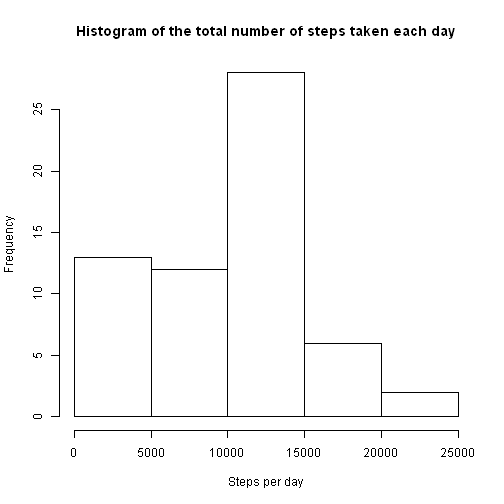
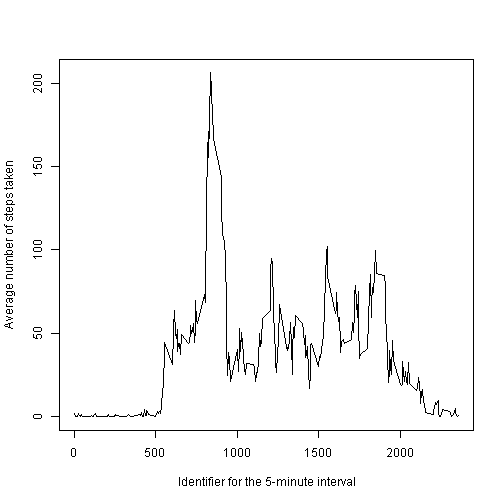
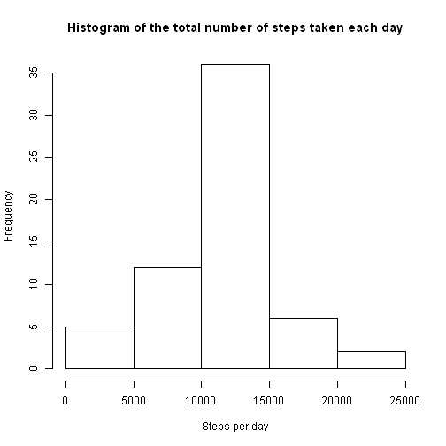
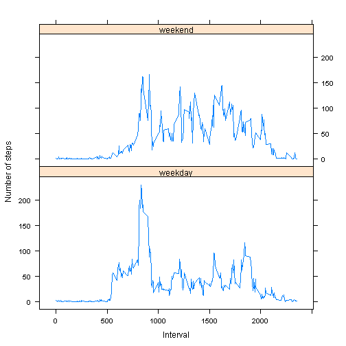

"Reproducible Research: Peer Assessment 1"
==================================================================

This assignment makes use of data from a personal activity monitoring device. This device collects data at 5 minute intervals through out the day. The data consists of two months of data from an anonymous individual collected during the months of October and November, 2012 and include the number of steps taken in 5 minute intervals each day.

The data for this assignment can be found in this repository (activity.zip). The variables included in this dataset are:  
 - steps: Number of steps taking in a 5-minute interval (missing values are coded as NA)  
 - date: The date on which the measurement was taken in YYYY-MM-DD format  
 - interval: Identifier for the 5-minute interval in which measurement was taken

The dataset is stored in a comma-separated-value (CSV) file and there are a total of 17,568 observations in this dataset.

## Loading and preprocessing the data

Data is loaded in two steps:  
1. Zip archive is unpacked  
2. Data is loaded


```r
#unzip archive
unzip("activity.zip")

#load data
data <- read.csv("activity.csv", header = TRUE, stringsAsFactors=FALSE)
```

## What is mean total number of steps taken per day?

Calculate the total number of steps taken per day and generate histogram


```r
# calculate total number of steps per day
total_per_day <- aggregate(data$steps, list(day = data$date), sum, na.rm = TRUE)

# set column name
colnames(total_per_day)[2] <- c('steps')

# create histogram
hist(total_per_day$steps, xlab = "Steps per day", main = "Histogram of the total number of steps taken each day")
```

 

Calculate and report the mean and median of the total number of steps taken per day


```r
# calculate mean
total_steps_per_day_mean <- mean(total_per_day$steps, na.rm = TRUE)

# calculate median
total_steps_per_day_median <- median(total_per_day$steps, na.rm = TRUE)
```

Calculated mean is **9354.2295082** and median is **10395**.

## What is the average daily activity pattern?

Calculate a data for time series plot of the 5-minute interval (x-axis) and the average number of steps taken, averaged across all days (y-axis). Make a time series plot


```r
# calculate average
average_per_day <- aggregate(data$steps, list(interval = data$interval), mean, na.rm = TRUE)

# set column name
colnames(average_per_day)[2] <- c('mean')

# create plot
plot(average_per_day$interval, average_per_day$mean, type="l", ylab = "Average number of steps taken", xlab = " Identifier for the 5-minute interval")
```

 

Find 5-minute interval, on average across all the days in the dataset, contains the maximum number of steps


```r
# find interval
interval_max <- average_per_day[which.max(average_per_day[,2]), "interval"]
```

Maximum interval is **835**.

## Imputing missing values

Calculate and report total number of missing values in the dataset (the total number of rows with NAs)


```r
# calculate number of rows with missing values
sum(is.na(data[, "steps"]))
```

```
## [1] 2304
```

Fill missing data with the mean for that 5-minute interval


```r
# copy dataset
filled_data <- data

#fill new dataset
for(i in 1:nrow(filled_data)) {
  if(is.na(filled_data[i, "steps"])) {
    filled_data[i, "steps"] <- average_per_day[average_per_day$interval == filled_data[i, "interval"], "mean"]
  }
}
```

Calculate the total number of steps taken per day and create histogram


```r
# calculate sum
na_rm_total_per_day <- aggregate(filled_data$steps, list(day = filled_data$date), sum)

# set column name
colnames(na_rm_total_per_day)[2] <- c('steps')

# create histogram
hist(na_rm_total_per_day$steps, xlab = "Steps per day", main = "Histogram of the total number of steps taken each day")
```

 

Calculate and report the mean:


```r
mean(na_rm_total_per_day$steps)
```

```
## [1] 10766.19
```

Calculate and report median:


```r
median(na_rm_total_per_day$steps)
```

```
## [1] 10766.19
```

What is the impact of imputing missing data on the estimates of the total daily number of steps? Calculcate and report difference between total number of steps between datasets.


```r
sum(na_rm_total_per_day[, "steps"]) - sum(total_per_day[, "steps"])
```

```
## [1] 86129.51
```

## Are there differences in activity patterns between weekdays and weekends?

Create a new factor variable in the dataset with two levels – “weekday” and “weekend” indicating whether a given date is a weekday or weekend day.


```r
# set locale (english abbreviate of weekday is used)
Sys.setlocale("LC_TIME","English United States")

# get logical vector
weekdays <- weekdays(as.Date(data$date), abbreviate = TRUE) %in% c("Sat", "Sun")

# create factor variable in dataset
filled_data$weekday <- factor(weekdays, labels = c("weekday", "weekend"))
```

Make a panel plot containing a time series plot of the 5-minute interval (x-axis) and the average number of steps taken, averaged across all weekday days or weekend days (y-axis).


```r
#load library
library(lattice)

# calculate mean
filled_average_per_day <- aggregate(filled_data$steps, list(interval = filled_data$interval, weekday = filled_data$weekday), mean)

# set column name
colnames(filled_average_per_day)[3] <- c('mean_steps')

# create panel plot
xyplot(mean_steps ~ interval | weekday, data = filled_average_per_day, type="l", layout = c(1, 2), ylab = "Number of steps", xlab = "Interval")
```

 
